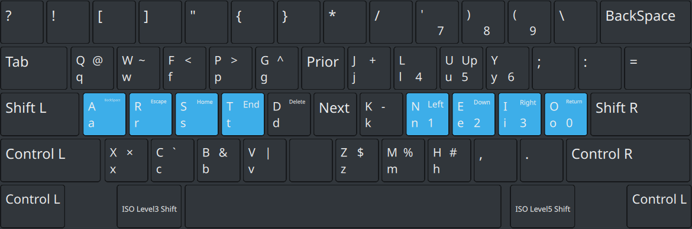

## Motivation

I type every day and believes it is worth switching to a more efficient
keyboard, specifically the Modified Colemak Programming keyboard.

## OS

I use Mac, Windows, Linux operating systems, Samsung Dex and iPad.

## Why Colemak Upgrade

No reason. I just read about the layout being efficient when practising touch
typing.

## My Layout Approach -> English based

Occasionally, when I need to concentrate on my laptop, I still rely on the software approach to utilize the laptop keyboard.

1. I have been utilizing a software remapping approach for the past two years.

   - The downside is only support Mac, Linux & Windows platforms.
   - Mac using Karabiner-elements

2. I have recently transitioned to using a programmable keyboard as my preferred method.
   - Unlocked other platforms: Mac iPad, Samsung Dex

## Programmable keyboards (QMK)

In order to not lose ability to type on my laptop keyboard. I have made an
intention decision to not use the cool split keyboards. Here are the cool
keyboard am currently using.

1. Nuphy v2 Air 75 (low-profile mechanical keyboard)
2. Keychron k2 Pro (mechanical keyboard)

## The layout

